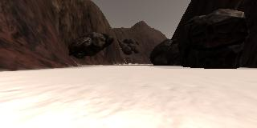
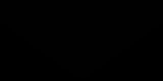
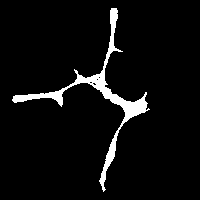

# Udacity_rover_search_sample_return
Udacity's Robotics Software Engineer nano degree Term 1 project 1(Search and Sample return)

### Installation

Setup the python environment to run the simulator and jupyter notebook with the required python packages/modules
[Instructions to setup python environment](https://github.com/udacity/RoboND-Python-StarterKit/blob/master/doc/configure_via_anaconda.md)

Downlaod the rover simulator appropriate for your OS([macOS](https://s3-us-west-1.amazonaws.com/udacity-robotics/Rover+Unity+Sims/Mac_Roversim.zip), [Linux](https://s3-us-west-1.amazonaws.com/udacity-robotics/Rover+Unity+Sims/Linux_Roversim.zip),[Windows](https://s3-us-west-1.amazonaws.com/udacity-robotics/Rover+Unity+Sims/Windows_Roversim.zip))

clone this repository

```
git clone https://github.com/mvivek16/Udacity_search_and_sample_return.git 
```

**Training / Calibration**  

* Download the rover simulator and record data in "Training Mode"
* Launch the jupyter notebook inside the code folder and click on the .ipynb extension file.
* There is already prerecorded data inside **./data** folder
* Place your recorded data in any folder to run the notebook functions on your data.
* The data path should be updated in the notebook
```
path = '../data/IMG/*'
```

### Notebook analysis
Once the notebook is launched run each cell one by one or all of them to check the ouput, the output video will be placed in the ./output folder
under name 'test_mappingrec.mp4'

If running on different dataset and want to create a new output file remane here in cell 16
```
output = '../output/test_mappingrec.mp4'
```

* **obstacle identification**
From the analysis of rover images in interactive window, shows that the ground navigable terrain has higher pixel values than the obstacle mountains or sky.
  - We use cv2 functions and apply perspective transform to images, this converts the rover camera images to a top down view
  - For perspective transform, the source and destination points should be provided, source points are sampled from the the 
  ./calibration_images/example_grid1.jpg
  - color thresholding of this top down image, to indicate navigabble terrain as white and obstacles as black
  - we use a mask to neglect all the pixel values that are outside the field of vision of camera
  
Image sequence and code snippets to achieve the above are shown below

 




```
def perspect_transform(img, src, dst):
           
    M = cv2.getPerspectiveTransform(src, dst)
    warped = cv2.warpPerspective(img, M, (img.shape[1], img.shape[0]))# keep same size as input image
    mask = cv2.warpPerspective(np.ones_like(img[:,:,0]), M, (img.shape[1], img.shape[0]))
    return warped, mask

threshed = color_thresh(warped)
obs_map = np.absolute(np.float32(threshed) - 1) * mask

```
* **rock sample identification**
  - rock sample is analysed from the ./calibration_images/example_rock1.jpg
  - find rocks function is defined based on the thresholds found.


```
def find_rocks(img, levels = (110,110,50)):
    rockpix = ((img[:,:,0] > levels[0])\
              & (img[:,:,1] > levels[1])\
              & (img[:,:,2] < levels[2]))
    
    color_select = np.zeros_like(img[:,:,0])
    color_select[rockpix] = 1
    
    return color_select
```

* **process_image()** contents how the worldmap is populated and video output
  - ground_truth_map is read from ./calibration_images/map_bw.png
  - world map is created by populating 255 values for pixel positions where navigaballe terrain, obstacles or rocks or found respectively.
  - the world map is superimposed on ground truth map



```
data.worldmap[y_world, x_world, 2] = 255
    data.worldmap[obsy_world, obsx_world, 0] = 255
    nav_pix = data.worldmap[:,:,2] > 0
    data.worldmap[nav_pix,0] = 0
    
    rock_map = find_rocks(warped, levels = (110,110,50))
    if rock_map.any():
        rock_x, rock_y = rover_coords(rock_map)
        rock_x_world, rock_y_world = pix_to_world(rock_x,rock_y,xpos,ypos,yaw,world_size,scale)
        data.worldmap[rock_y_world,rock_x_world,:] = 255
map_add = cv2.addWeighted(data.worldmap, 1, data.ground_truth, 0.5, 0)
```
The video output is located at ./output/test_mappingrec.mp4


### Autonomous navigation and mapping

* **perception_setp()** 
 - This is almost the same as the process_image() in the notebook analysis except the input is from the Rover object.
Update the RGB channels of worldmap wrt to obstacle, terrain and rocks respectively
 - Navigation angles are updated

```
Rover.vision_image[:,:,2] = threshed * 255
Rover.vision_image[:,:,0] = obs_map * 255

if found rocks
  Rover.worldmap[rock_ycen,rock_xcen,1] = 255
  Rover.vision_image[:,:,1] = rock_map * 255
```
```
dist, angles = to_polar_coords(xpix, ypix)
Rover.nav_angles = angles
```
 
* **decision_step()**

  - The same default code is used, no modification is done.

### Simulator settings

Roversim_x86_64.exe
Graphics:
  - Screen: 800 x 600
  - Graphics quality: Good
  - Select monitor: Display 1
  Windowed
